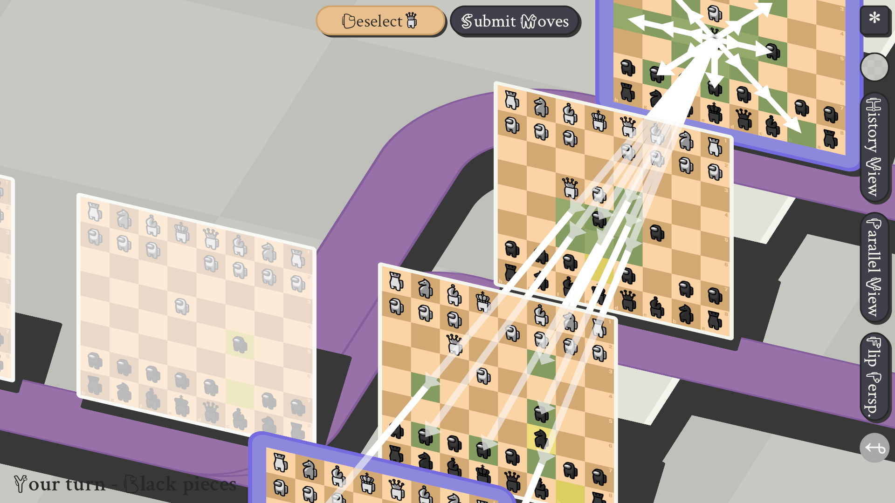

# SusChess with Mogusverse Vent Travel.
A very sussy mod for "5D Chess With Multiverse Time Travel". Play with sussy pieces, enjoy the sussy fonts and when you finish a game, prepare for a ... SUSprise!!

## Installation

1. Copy your "5D Chess With Multiverse Time Travel" folder (i. e. the folder that contains the "5dchesswithmultiversetimetravel.exe"; it should be named "5dchesswithmultiversetimetravel" and can be found in "SteamLibrary/steamapps/common" if you've got the game from Steam) and name the copy anything you like, for example "SusChess".
2. Download this mod by clicking the green button that reads "Code" on this page and chossing "Download as ZIP".
3. Replacing the chess pieces and the fonts: Open the zip file and pull the folder "assets" onto your "SusChess" folder. You will be asked if you want to merge the folders (say "yes") and if you want to replace the files (choose "replace" for all files).
4. Changing the text inside the program and icon: You'll need the rom patcher FLIPS from this site: https://www.smwcentral.net/?a=details&id=11474&p=section (Direct download link [HERE](https://dl.smwcentral.net/11474/floating.zip)).
Download the zip file, open it, click on flips.exe, choose "apply patch", select "sus_chess.bps" as the "patch to use", "5dchesswithmultiversetimetravel.exe" as the "file to patch", and save the output file ("sus_chess.exe") in your "SusChess" folder. (This step might fail if you have a different version of the game than the one I made the patch for. In this case, notify me by opening an "Issue" so I can make a patch for your version. But even without this step you'll still have the Among Us chess pieces and the among us font.)

Have fun!

## TODO

Fairy chess pieces are still lacking. For the time being, I just copied the sprites for the regular chess pieces. Feel free to modify the lower half of pieces.png in assets/pieces and make a pull request to contribute proper fairy chess pieces!

## Donations

You can support me by sending Monero! My wallet: 

 48tZVr959JfZ6p5BRkHFnJA3qbQx9qN7gg1AJNjzgNexSyMVVPww5nF3b5RNmfrZzwBjYFxYpGBU5ZvJHyMd7Mje2Uh4728

